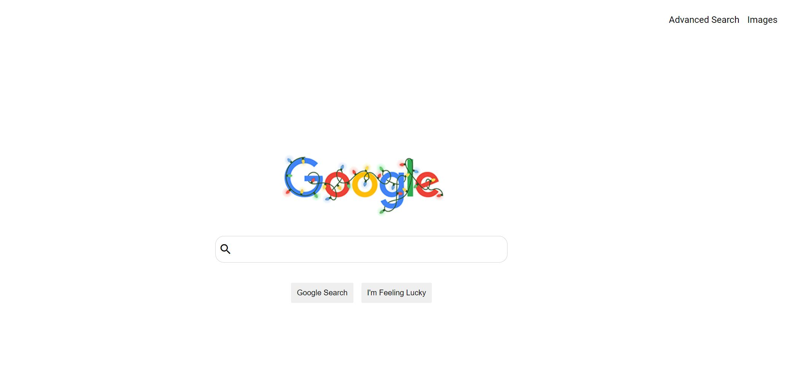
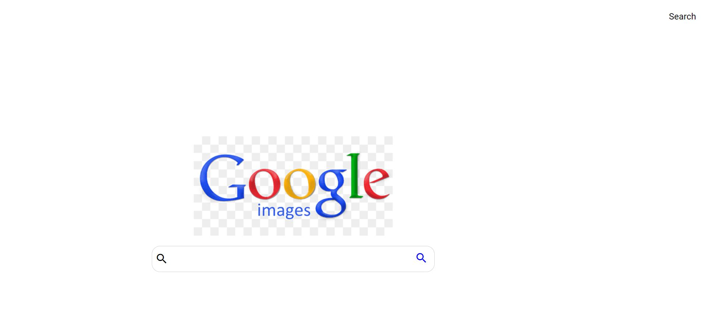
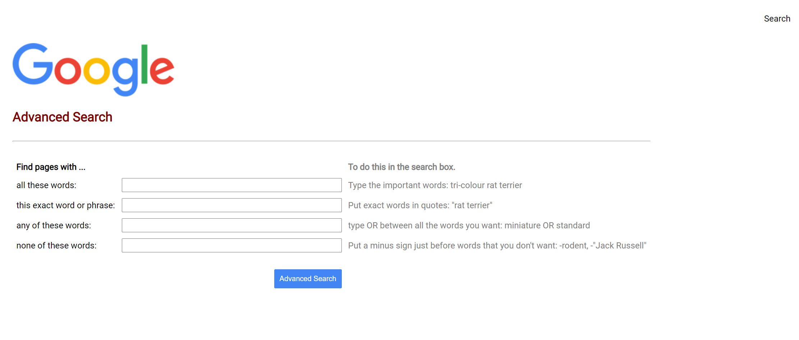

# Search

Design a front-end for Google Search, Google Image Search, and Google Advanced Search.

The project requirements can be found [here](https://cs50.harvard.edu/web/2020/projects/0/search/#:~:text=Design%20a%20front-end%20for%20Google%20Search,%20Google%20Image%20Search,%20and%20Google%20Advanced%20Search.)

The index page is a close replica of Google's main search page

The search and "I'm Feeling Lucky" buttons replicate Google's own behaviour where the latter takes the user directly to the first Google search result.
The navigation located at the top right contains links to a simplified Google Advanced Search page and a Google Image Search Page.

